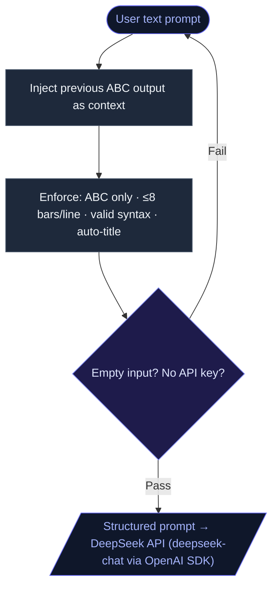
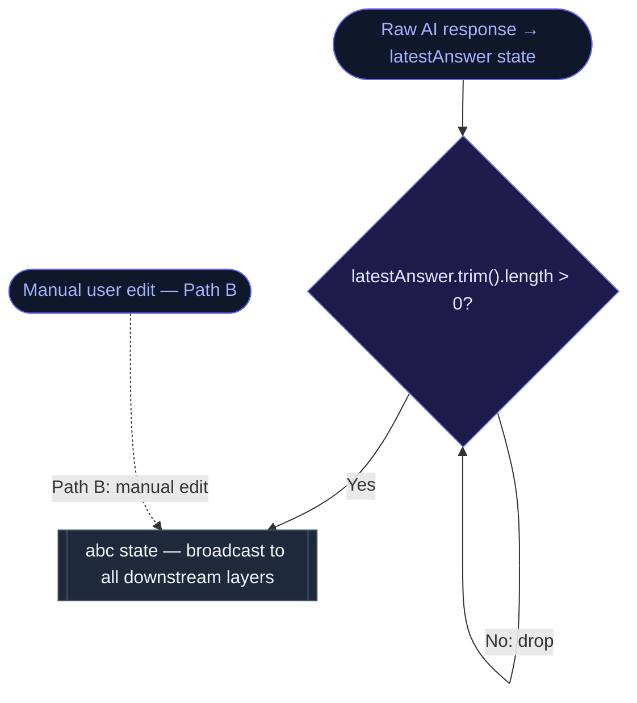
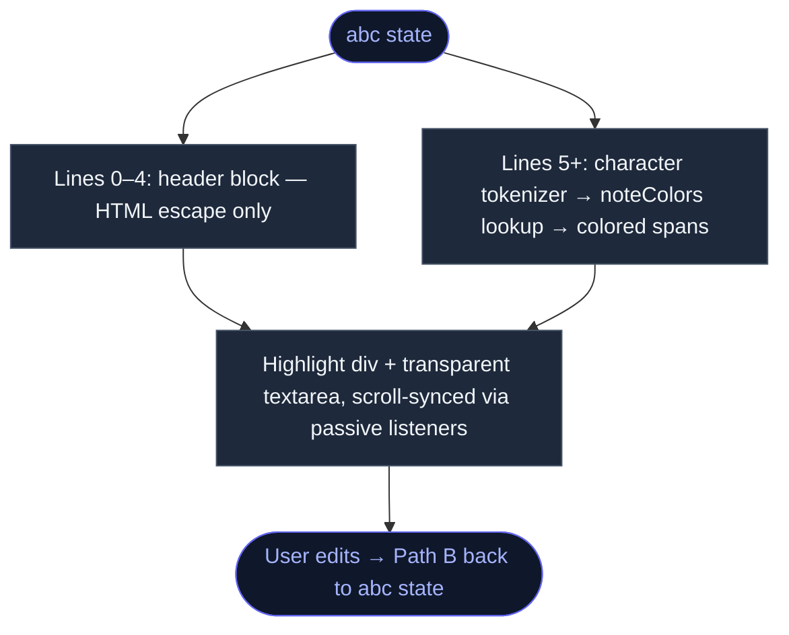
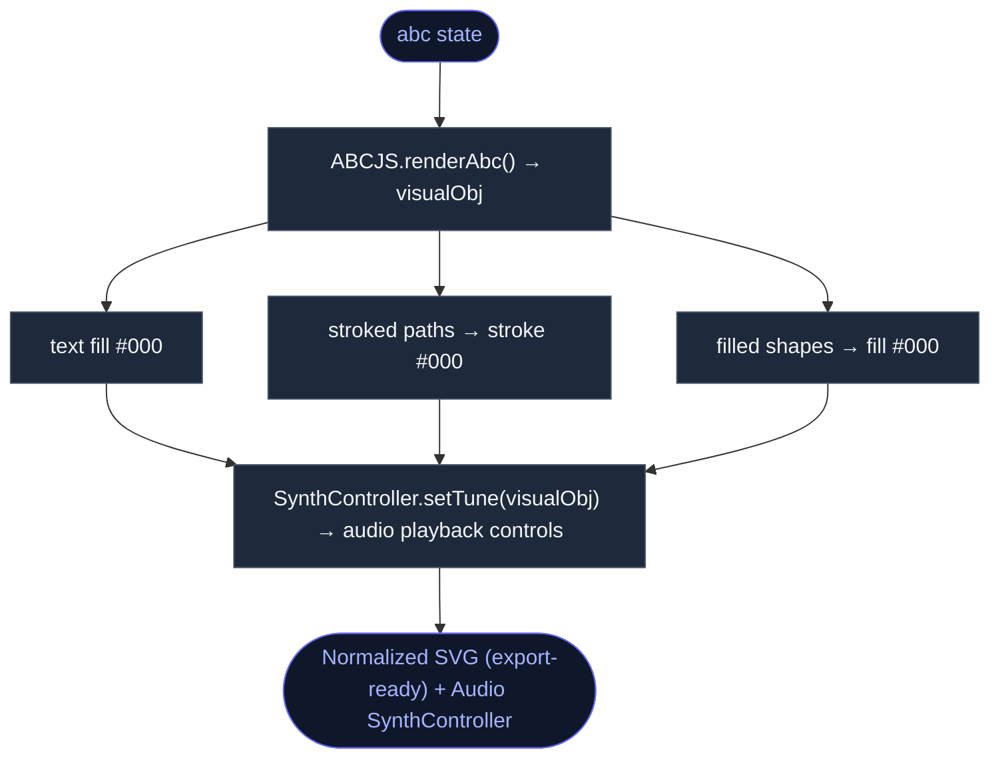
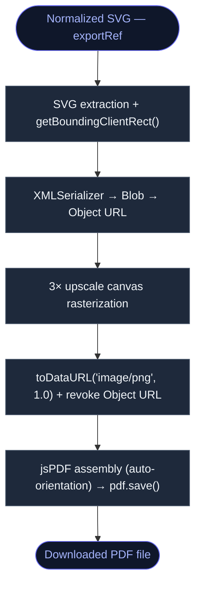

# VibeCompose

**VibeCompose** is a browser-based music composition tool that connects AI
generation with ABC notation. Write, edit, and render sheet music in real-time.

## Demo

## Features
 
* **AI Composition**: Chat-based interface powered by the DeepSeek API. Describe what you want ("melancholic melody in D minor") and get ABC notation back.
* **Live ABC Editor**: Edit [ABC notation](https://abcnotation.com/) directly, whether you're tweaking AI output or writing from scratch.
* **Sheet Music Rendering**: Notation renders to sheet music in real-time via `abcjs`.
* **PDF Export**: Export your composition as a PDF score.
* **UI**: Dark theme, responsive, built with Tailwind CSS v4.
## Tech Stack
 
* **Framework**: [Next.js 15](https://nextjs.org/) (App Router)
* **Library**: [React 19](https://react.dev/)
* **Styling**: [Tailwind CSS v4](https://tailwindcss.com/)
* **Music Rendering**: [abcjs](https://www.abcjs.net/)
* **AI Integration**: [OpenAI Node SDK](https://github.com/openai/openai-node) (pointed at DeepSeek API)
* **Export**: `jspdf` + `html2canvas`
## How It Works
 
1. **Prompt Construction Layer (`chatbot.tsx`)**
   Each request includes the previous ABC output as context, so the AI refines existing music rather than generating from scratch. The prompt enforces strict output constraints — valid ABC notation, correct headers, and line length limits — and runs basic input validation before hitting the DeepSeek API via the OpenAI Node SDK.

 
2. **State Management (`page.tsx`)**
   The root component keeps the raw AI response and the live editor notation as separate state values. A guard prevents a blank or errored AI response from overwriting what's in the editor. Manual edits and AI-generated output both flow into the same notation state, so the rest of the app doesn't care which path produced it.

 
3. **Syntax-Highlighted Editor (`ABCEditor.tsx`)**
   The editor layers a syntax-highlighted `div` beneath a transparent `textarea`, keeping them scroll-synced. The header lines render as plain text; everything below gets tokenized — notes and bar lines are each assigned a color and wrapped in spans. The result is a lightweight code-editor feel without pulling in a full editor library.

 
4. **Rendering & SVG Normalization (`sheet.tsx`)**
   Every notation change triggers a full re-render via `abcjs`. After rendering, a normalization pass forces all SVG elements to black regardless of the current theme, so the output is export-ready at all times. Audio playback stays in sync by binding directly to the same render output.

 
5. **PDF Export (`ExportPDFButton.tsx`)**
   Export runs entirely in the browser. The rendered SVG gets serialized, rasterized at 3× resolution for high-DPI output, then assembled into a PDF via `jsPDF`. Orientation is set automatically based on the sheet dimensions.

 
